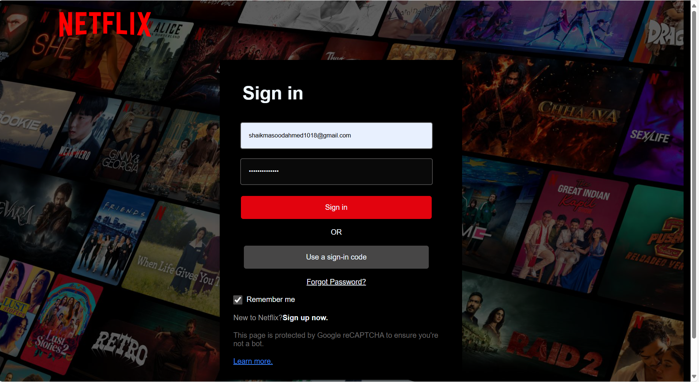
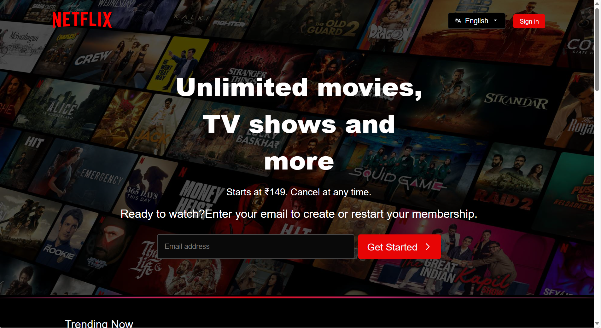
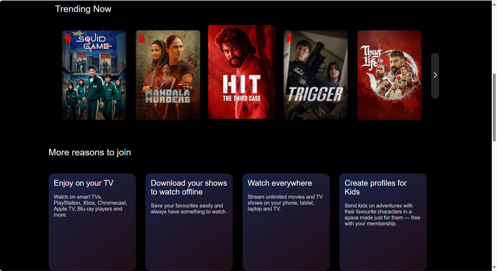
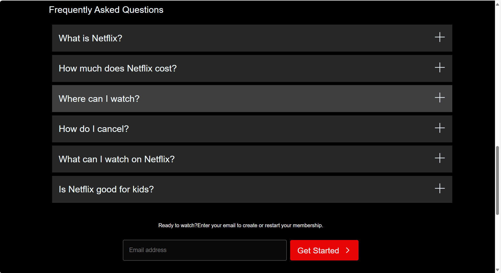
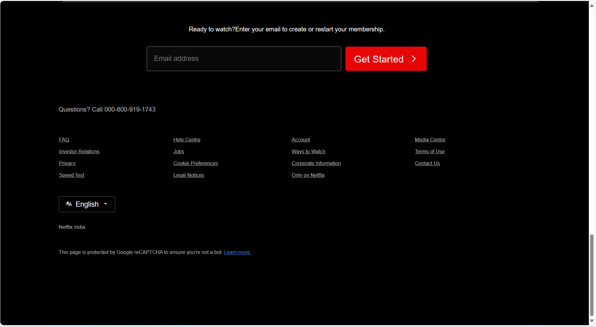

# 🎬 Netflix Sign-In & Sign-Up Clone

A **Netflix-inspired** sign-in and sign-up front page clone built using **pure HTML & CSS**.  
This project is for **practice and learning purposes only** — no backend, no JavaScript, just clean, responsive design.

  
*(Logo belongs to Netflix, used here for illustrative purposes)*

---

## 🚀 Features
- 📱 **Responsive Design** — Works on desktop & mobile  
- 🎨 **Pixel-perfect Styling** — Mimics Netflix’s official UI  
- ⚡ **Lightweight** — No frameworks, no JavaScript  
- 🧩 **Clean Code** — Easy to read and modify  

---

## 🛠️ Technologies Used
- **HTML5**
- **CSS3**

---

## 📷 Preview
> 

> 

> 

> 

> 

---

## 📜 Disclaimer
This project is **not affiliated with Netflix**.  
All product names, logos, and brands are property of their respective owners.  

---
💡 *Built with ❤️ for practice and learning.*
